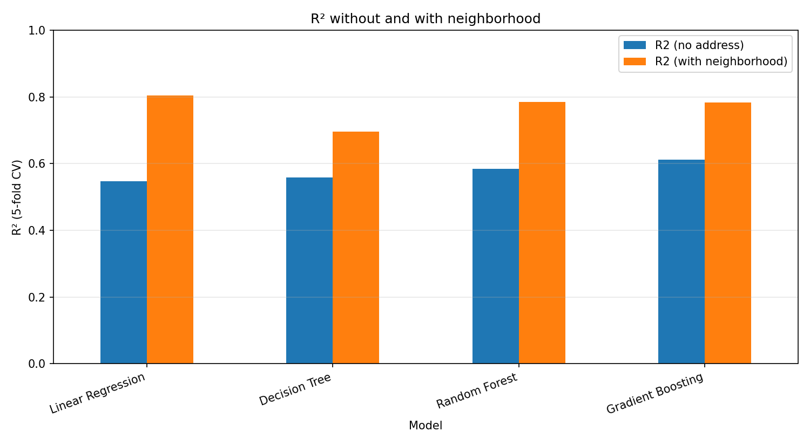
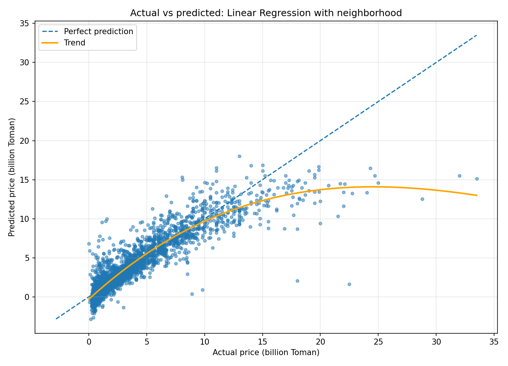
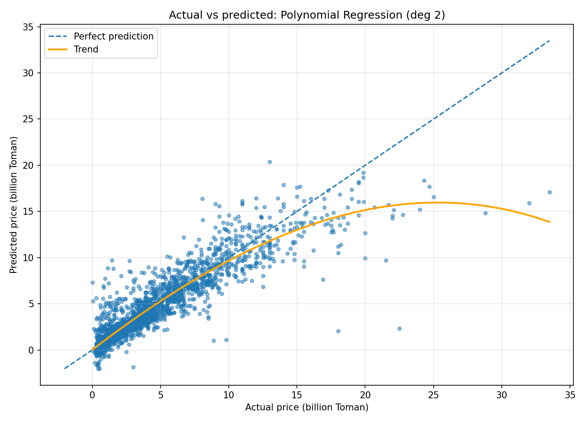
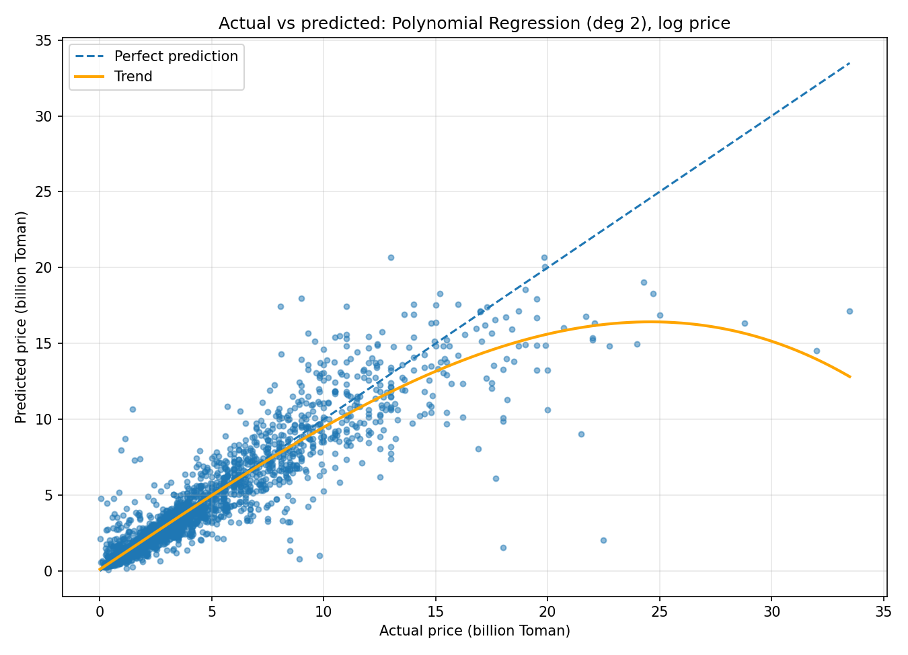

# Tehran House Price Prediction

Predicting apartment prices in Tehran from listing data. The project was built in four steps, each adding something to the previous one:

1. Baseline models using only the property features
2. The same models with the neighborhood from the address
3. Polynomial regression
4. Predicting the log of the price

Every score is a 5-fold cross-validation average (shuffled, `random_state=42`), so the numbers are comparable across steps. Neighborhood encoding and scaling happen inside the pipelines, so they are only fitted on training folds.

## Data

The data is the [House Price (Tehran, Iran)](https://www.kaggle.com/datasets/mokar2001/house-price-tehran-iran) dataset on Kaggle by mokar2001. It has 3,479 listings with these columns: `Area`, `Room`, `Parking`, `Warehouse`, `Elevator`, `Address`, `Price`, `Price(USD)`. `Price(USD)` is just `Price` at a fixed rate, so it is not used as a feature.

Cleaning:

- rows with a missing or blank address are dropped
- rows with an invalid `Area` are dropped
- `Area` outliers are removed with the 1.5×IQR rule (3,212 rows left)
- exact duplicate listings are removed (3,010 rows left)

Prices are in Toman. The CSV is not tracked in git. Download it from Kaggle and save it as `data/raw/tehran_house_prices.csv`, and check the dataset's license before redistributing it.

## Step 1: baseline

Features: `Area`, `Room`, `Parking`, `Warehouse`, `Elevator`. The address is not used, so the models know nothing about location.

| Model | R² | MAE (Toman) | RMSE (Toman) |
|---|---:|---:|---:|
| Gradient Boosting | 0.6123 | 1.543B | 2.413B |
| Random Forest | 0.5851 | 1.607B | 2.491B |
| Decision Tree | 0.5586 | 1.650B | 2.566B |
| Linear Regression | 0.5473 | 1.766B | 2.609B |

## Step 2: adding the address

Raw addresses are lowercased and stripped, and direction words (north, south, east, west, northern, southern, central) are removed so that variants of one neighborhood share a label. This takes the number of distinct labels from 187 to 180. The neighborhood is one-hot encoded and added to the five features from step 1.

| Model | R² | MAE (Toman) | RMSE (Toman) |
|---|---:|---:|---:|
| Linear Regression | 0.8037 | 1.023B | 1.721B |
| Random Forest | 0.7845 | 0.943B | 1.799B |
| Gradient Boosting | 0.7840 | 1.073B | 1.803B |
| Decision Tree | 0.6957 | 1.083B | 2.127B |

R² goes up for all four models. Linear Regression improves the most, from 0.5473 to 0.8037.



The notebook also has a rough neighborhood price factor: for each Punak listing, listings from other neighborhoods with an area within 10% are compared by price, and the median ratio per neighborhood is reported. This is only an exploration and is not used as a model feature.



The plot is built from out-of-fold predictions. The trend flattens at the high end: expensive apartments are predicted lower than their real price.

## Step 3: polynomial regression

Polynomial terms are built for `Area` and `Room` (for degree 2: `Area²`, `Area·Room`, `Room²`), standardized, and a linear model is fitted on top. The binary columns and the one-hot neighborhoods are not expanded, since ~180 neighborhood columns would give thousands of features for about 2,400 training rows.

Standardizing is needed. Without it `Area³` reaches millions next to 0/1 columns and the degree 3 fit breaks down numerically (R² around 0.58 in a test run).

| Degree | R² | MAE (Toman) | RMSE (Toman) |
|---|---:|---:|---:|
| 1 (plain linear) | 0.8036 | 1.023B | 1.722B |
| **2** | **0.8257** | 0.923B | 1.620B |
| 3 | 0.8215 | 0.919B | 1.642B |
| 4 | 0.8250 | 0.912B | 1.624B |

Degree 2 is better than the plain linear model in all five folds, and higher degrees add nothing, so degree 2 is used.



## Step 4: log of the price

Prices are strongly right-skewed, so the most expensive apartments dominate the squared error. The models are trained on `log1p(Price)` and predictions are converted back with `expm1`. Metrics are computed on the original Toman scale.

| Model | R² | MAE (Toman) | RMSE (Toman) |
|---|---:|---:|---:|
| **Polynomial Regression deg 2 (log)** | **0.8445** | 0.774B | 1.531B |
| Linear Regression (log) | 0.8407 | 0.788B | 1.546B |
| Polynomial Regression deg 2 | 0.8257 | 0.923B | 1.620B |
| Linear Regression | 0.8037 | 1.023B | 1.721B |
| Random Forest | 0.7845 | 0.943B | 1.799B |
| Gradient Boosting | 0.7840 | 1.073B | 1.803B |
| Random Forest (log) | 0.7757 | 0.959B | 1.839B |
| Gradient Boosting (log) | 0.7470 | 1.068B | 1.956B |
| Decision Tree | 0.6957 | 1.083B | 2.127B |

The log target clearly helps the linear models: for plain Linear Regression R² goes from 0.8037 to 0.8407 and MAE drops from 1.02B to 0.79B. It does not help Random Forest or Gradient Boosting.

With the log target, the polynomial model is only marginally ahead of the linear one (R² 0.8445 vs 0.8407) and it wins in 3 of 5 folds, so that gap is within noise. Degree 3 with the log target is unstable (one fold fails badly, standard deviation 0.20).



## Limitations

- About 100 of the 180 neighborhoods have 5 or fewer listings, so their coefficients are noisy. Grouping rare neighborhoods or regularizing would be worth trying.
- Random Forest and Gradient Boosting use mostly default settings, while the polynomial degree was compared across a few values. A fair comparison would tune all of them.
- The improvement from the address shows that location is informative, not that it causes the price difference.
- The listings have no date, so inflation over the scrape period is not accounted for.

## Running it

```bash
pip install -r requirements.txt
jupyter notebook notebooks/tehran_house_price_prediction.ipynb
```

Running the notebook regenerates everything in `outputs/`.

## Structure

```
data/raw/            dataset (not tracked)
notebooks/           analysis notebook
outputs/             metrics CSVs and plots
requirements.txt
```
